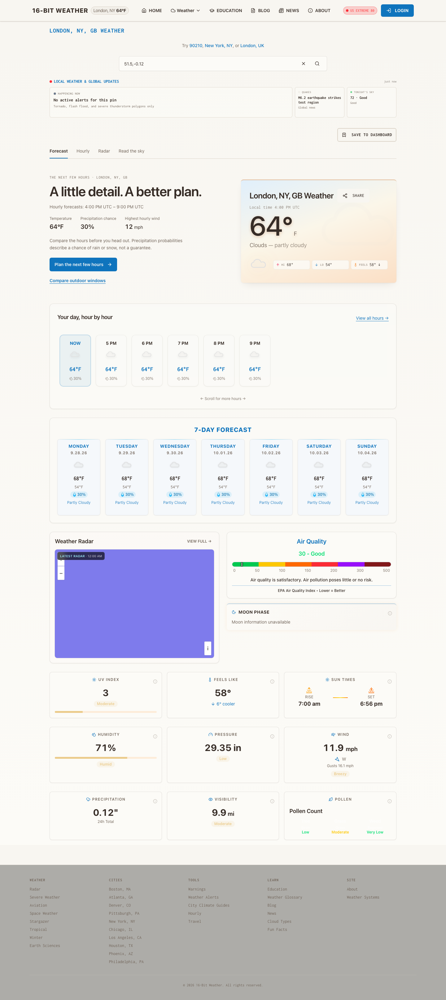
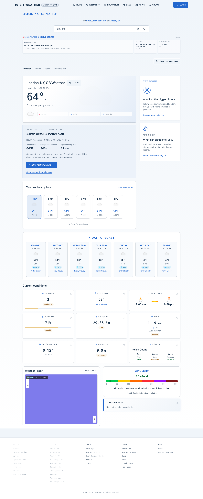
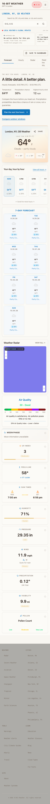
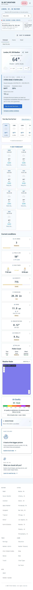

# Clear Sky verification — September 28, 2026

Implemented against main `53bd65b7d3a5e15faa0705de3fd4c5216f971072` on `codex/clear-sky`. Scope: [PRD](prds/PRD-clear-sky.md). The five-theme prototype is independently reviewed and preserved on `codex/prototype-theme-concepts` at `14a8df383ca74980c27e50bb72ec3edef3981e9c`; it is excluded from this production branch.

## Matched data comparison

Both the base revision and implementation were built in isolated worktrees and served in production mode. The same London fixture and clock supplied seven daily forecasts and 48 hourly readings. Chromium and Firefox covered 320, 390 and 1440 px. All nine condition-card text inventories matched exactly in all six comparisons; all seven daily cards remained. The intentional differences are layout, typography, palette, contrast, and honest unavailable states.

| Data | Fixture/result |
|---|---|
| Current/feels like | 64°F / 58°F; 6° cooler preserved |
| Daily/hourly | Seven daily cards, six-hour preview, full hourly link and expanded daily detail |
| UV/humidity | 3 / Moderate; 71% / Humid |
| Pressure | Provider 994 hPa → existing conversion 29.35 in; unchanged |
| Wind | 11.9 mph W, gusts 16.1 mph |
| Sun | 7:00 am rise / 6:56 pm set |
| Precipitation/visibility | 0.12 in total / 9.9 mi (existing conversion from 16,000 m) |
| Pollen | Birch Low, Grass Moderate, Ragweed Very Low; formerly faint labels now readable |
| AQI/Moon | AQI 30 / Good retained; absent Moon stays unavailable. Valid zero illumination and partial Moon behavior covered separately by rendered tests. |
| Units | Rendered tests pin °F/in/mph and °C/hPa/km/h without changing provider contracts. |

[Raw inventories](clear-sky-evidence/data-parity.json). Screenshots use deterministic data and stub map tiles; they are evidence of composition and data retention, not live meteorological imagery.

| Before | After |
|---|---|
|  |  |
|  |  |

At 320 px the base overflowed because the Forecast/Hourly/Radar/Read the sky row could not wrap. Wrapping that navigation eliminated the overflow in both browsers without removing links. The new sidebar appears once, follows the hero/hourly region in desktop keyboard order, and follows weather details on mobile. Desktop Tab progression is covered explicitly.

## Local validation

- Baseline: 274 suites / 2,118 tests passed before implementation.
- Final: 275 suites / **2,141 tests passed**; production build, both TypeScript projects, lint (**0 errors / 88 warnings**), and Knip passed.
- Database suite: **9 tests passed**. The new migration preserves existing Daybreak/Nord rows, allows each of seven themes, defaults only new rows to Clear Sky, and rejects an invalid identifier.
- Production Chromium/Firefox: **74 cases passed**, including first-visit geolocation/search recovery, saved weather, stale/missing data, outdoor planning, travel hazards, Moon timezone context, radar playback/age and delayed lesson/return navigation.
- After the final radar/navigation presentation corrections, all **20 affected Clear Sky and connected-journey cases passed again**. Coverage includes 320/390/1440 px, full condition labels, one sidebar, keyboard order, daily expansion, location-preserving links and saved Daybreak reload.
- After the final contrast/progress correction, all **8 Clear Sky browser cases passed again**, alongside the full 2,141-test unit suite and production build. Progress semantics reproduced two failing assertions before the fix; all 38 focused assertions passed afterward.
- Saved-theme rendering smoke exercised all seven identifiers with a mocked authenticated browser session; all retained nine condition cards and seven daily cards. Additional 200% CSS zoom simulation retained the data and had no document overflow; this supplements responsive checks rather than proving native browser text-only zoom.
- Tablet smoke exposed full-header overflow at 768/1024 px (3 of 4 browser cases failed before correction). The compact menu now remains active below 1280 px and has viewport-bounded scrolling. All **12 final Clear Sky cases passed**. One earlier desktop focus assertion raced the separately lazy-loaded forecast; the test now waits for that target before tabbing and retains its focus assertion. Four navigation unit tests, the production build, scoped lint and test types passed after the tablet changes. The expanded Clear Sky matrix covers 320/390/768/1024/1440 px and bottom-menu navigation at a 768 px viewport height. The preliminary bottom-link test passed before scroll containment, so this is not claimed as a reproduced unreachable-link defect.
- Additional matched-data comparison: **12 renders** (before/after × three widths × two browsers); identical metric inventories and seven daily cards, with no final overflow.
- Read-only desktop route smoke: home, education, glossary, cloud atlas, weather systems, hourly, radar, travel, Stargazer, severe, warnings, space weather, aviation, blog, login and dashboard returned 200 with no uncaught browser exceptions or document overflow. This is route compatibility evidence, not authenticated end-to-end coverage of every tool.
- Missing/nonfinite AQI and invalid precipitation regressions failed before correction (4 cases), then passed. Partial Moon regressions failed before correction (2 cases), then passed. Valid zero measurements remain measurements, not missing values.
- Contrast tests cover Clear Sky foreground/action/muted text on its background/card/input surfaces. Auth fills, footer, pollen/status text, radar loading/entry and explanatory text use semantic theme colors. Forecast/radar severity scales and map imagery keep their meanings.

Logs are local `/tmp/clear-sky-{baseline,unit,build,types,test-types,lint,knip,db-all,final-e2e,final-compatibility-e2e,compatibility-tests,parity,comparison}.log` and route output `/tmp/clear-sky-routes.json`.

## Independent review

The requested Bugbot role was unavailable (`unknown agent_type 'bugbot'` on both required attempts). The user explicitly selected Matt Pocock's `code-review` skill instead.

- **Standards:** found desktop sidebar focus order. Fixed and independently re-reviewed clear.
- **Spec:** found the same focus-order issue and partial Moon illumination falling back to zero. Fixed and independently re-reviewed clear.
- Both reviewers also inspected the radar/320 px corrections and final contrast/progress delta and found no actionable issues. A subsequent tablet review recommended bounding compact-menu scrolling; that correction was included and re-reviewed.
- Prototype preservation received a separate read-only precommit review with no findings.

The isolated dependency clone initially lacked generated Husky launchers. This was corrected with the repository's `prepare` script after the foundation commit; that exact commit was explicitly secret-scanned successfully. Subsequent commits use normal precommit hooks, and the normal pre-push hook scans all outgoing history and both TypeScript projects. No hook bypass or force push is used.

## Database rollout

The additive `20260928180049_user_preferences_clear_sky.sql` migration was applied through the Supabase migration API to the existing weather project before application publication. Its filename matches the recorded remote migration version. A read-only verification confirmed the seven-value constraint and `'clear-sky'::text` default. No saved preference values, RLS policies, account data, storage or billing settings were rewritten.

Local provider/service tests verify theme precedence and the explicit save request; disposable PostgreSQL tests verify round-trip constraints. No real user's account was used to exercise authenticated UI saves; integrated authenticated save/reload and native browser text-only zoom remain unverified locally. Keep the Clear Sky identifier accepted if rolling back presentation/defaults so newly saved choices remain valid.

## Performance and release status

Matched populated-forecast Lighthouse runs (three before, three after) retained median **98 performance**. CLS changed from median **0.02774** to **0.02766**. The final contrast/progress correction scored **98 performance / 100 accessibility / 96 best practices** on the loaded forecast. Its diagnostic SEO score is 66 because this unsupported city URL deliberately has noindex. The final run reported no contrast or unnamed-progress violations.

The five-run desktop homepage Lighthouse gate passed the repository-equivalent thresholds. Separate real-route diagnostics scored **100/100/92/100** for home, **100/100/96/100** for the lesson, and **100/100/96/100** for radar (performance/accessibility/best practices/SEO). These are local measurements, not a guarantee of field performance or a full accessibility audit. [Matched performance results](clear-sky-evidence/performance-comparison.json) and [final populated result](clear-sky-evidence/performance-final.json). Local Vercel analytics script 404s are deployment-only integration limitations. The unsupported London city diagnostic route deliberately emits `noindex, follow`; its SEO score is not a production canonical-page regression. The first unmocked forecast run hit the local rate limiter and is discarded as loaded-forecast performance evidence. Matched populated-forecast runs use identical fixture responses on the old and new production builds instead.

CI/CD and actual CodeRabbit review coverage must complete on the pushed head before merge readiness is claimed. Merging remains a separate user action.
