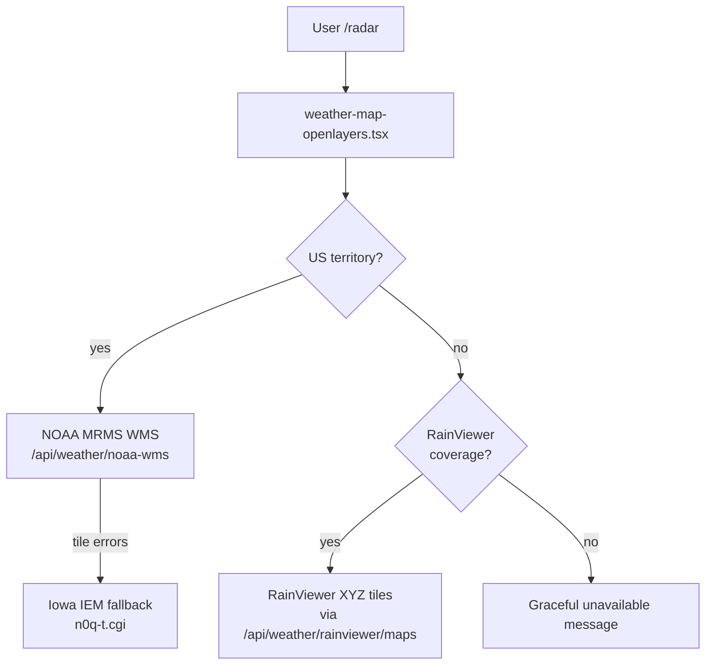

# PRD: Radar Modernization — Storm Watch & Global Coverage

**Version:** 1.0  
**Date:** 2026-05-22  
**Author:** Justin Elrod / AI-assisted analysis  
**Project:** 16-Bit Weather (16bitweather.co)  
**Branch:** `feat/radar-phase-1` (Phase 1), future phases on follow-up branches  
**Priority:** Medium (personal storm-watch quality; low traffic site)  
**Cost target:** $0/month at current usage (<5 radar sessions/week)

---

## Table of Contents

1. [Executive Summary](#1-executive-summary)
2. [Problem Statement](#2-problem-statement)
3. [Goals & Non-Goals](#3-goals--non-goals)
4. [Current State](#4-current-state)
5. [User Stories](#5-user-stories)
6. [Provider Architecture](#6-provider-architecture)
7. [Phase 1 — Core Reliability (this branch)](#7-phase-1--core-reliability-this-branch)
8. [Phase 2 — Dashboard UX (future)](#8-phase-2--dashboard-ux-future)
9. [Phase 3 — Polish & Resilience (future)](#9-phase-3--polish--resilience-future)
10. [Technical Design](#10-technical-design)
11. [Testing Strategy](#11-testing-strategy)
12. [Success Metrics](#12-success-metrics)
13. [Risks & Mitigations](#13-risks--mitigations)
14. [References](#14-references)

---

## 1. Executive Summary

Replace the hacked-together Iowa NEXRAD-only radar with a **reliable storm-watch experience**: live-accurate animation, NOAA MRMS in the US (with Iowa fallback), RainViewer tiles internationally where feeds exist, honest UX about radar limitations at night, and storm-watch-friendly controls.

Phase 1 ships on `feat/radar-phase-1` with **$0 infrastructure cost**. Later phases add a static homepage widget and day/night basemap without changing providers.

---

## 2. Problem Statement

| Issue | Impact |
|-------|--------|
| Timestamps computed once at mount | "LIVE" frame goes stale if map stays open; timeline drifts from real time |
| Iowa raw NEXRAD composite (not MRMS) | Night patches (AP, birds, clutter) shown as precipitation |
| Marketing says MRMS; code hits Iowa direct | Debugging confusion; unused secured proxies |
| US-only hard stop | No radar for international locations despite free global options |
| Dead layer toggles (clouds/wind/etc.) | Broken controls erode trust |
| Silent tile failures | Empty or patchy map with no explanation |

**User need:** Open 16bitweather.co instead of weather.com or AccuWeather for **local animated radar and storm tracking**, even on a low-traffic personal site.

---

## 3. Goals & Non-Goals

### Goals

- True **animated reflectivity** (dBZ-style loops), not just forecast POP
- **US:** NOAA MRMS via existing `/api/weather/noaa-wms` proxy
- **International:** RainViewer where coverage exists
- **Live frame stays current** during long sessions (5-minute refresh)
- **Storm-watch defaults:** latest frame, quick "play last 2 hours", clear attribution
- **$0/month** at current traffic

### Non-Goals (Phase 1)

- Self-hosted MRMS tile pipeline
- Paid commercial radar APIs (Xweather, Tomorrow.io, OpenWeather Maps 2.0 paid tiers)
- Static RadMap homepage widget (Phase 2)
- Day/night basemap switching (Phase 3)
- MRMS QPE alternate layer toggle
- SPC/warnings deep integration (separate features exist)

---

## 4. Current State

**Live path:** `components/weather-map-openlayers.tsx` → Iowa IEM `n0q-t.cgi` WMS-T (browser direct).

**Unused infrastructure:**

- `/api/weather/noaa-wms` — NOAA MRMS WMS proxy (CORS, rate limit, adaptive cache)
- `/api/weather/iowa-nexrad` — static Iowa WMS
- `/api/weather/iowa-nexrad-tiles` — Iowa XYZ tiles
- `/api/weather/radar/[layer]` — OpenWeather (precip returns 410)

**Coverage gate:** `isInMRMSCoverage()` in `lib/utils/location-utils.ts` — US territories only.

---

## 5. User Stories

1. **As a storm watcher in the US**, I open `/radar` and see the **latest MRMS loop** without refreshing the tab after an hour.
2. **As a user abroad**, I see **RainViewer radar** when available instead of a dead-end message.
3. **As a user at night**, I understand that **non-storm echoes** may appear on reflectivity maps.
4. **As a developer**, provider choice matches **SEO/copy (MRMS)** and uses **existing proxies** where possible.

---

## 6. Provider Architecture



| Region | Primary | Fallback | Cost |
|--------|---------|----------|------|
| US + territories | NOAA MRMS (proxy) | Iowa WMS-T | $0 |
| International | RainViewer | Message if no data | $0 |
| All | Carto dark basemap | — | $0 |

---

## 7. Phase 1 — Core Reliability (this branch)

### 7.1 Timestamp refresh

- Rebuild frame index every **5 minutes** (aligned to radar cadence)
- When user is on live frame, **auto-advance** to new latest after refresh
- Display **"Updated Xm ago"** based on latest frame time vs `Date.now()`

### 7.2 US provider switch

- Point WMS `TileWMS` at `/api/weather/noaa-wms`
- Params: `LAYERS=1`, `VERSION=1.3.0`, `CRS=EPSG:3857`, `TIME` animation
- After **5 consecutive tile errors**, fall back to Iowa `n0q-t.cgi` for session
- Badge: `MRMS` or `NEXRAD (fallback)`

### 7.3 International RainViewer

- New route: `GET /api/weather/rainviewer/maps` — proxies RainViewer JSON, caches 2 min
- Client uses RainViewer `past` frame list for animation (10-min steps typical)
- OpenLayers `XYZ` tile URL from RainViewer path template
- Attribution link to rainviewer.com

### 7.4 Storm-watch UX

- Default: **latest frame**, not playing
- **"Last 2h"** button: jump to ~2 hours ago and play to live
- Remove non-functional layer toggles; keep precipitation on/off + opacity
- Night artifact **tooltip** on legend area
- Tile error banner after repeated failures

### 7.5 Files (Phase 1)

| File | Action |
|------|--------|
| `planning/prds/PRD-radar-modernization.md` | Create (this doc) |
| `planning/prds/README.md` | Index entry |
| `lib/radar/radar-config.ts` | Constants |
| `lib/radar/radar-timestamps.ts` | Frame index builder + refresh hook |
| `lib/radar/rainviewer-types.ts` | Types |
| `app/api/weather/rainviewer/maps/route.ts` | RainViewer metadata proxy |
| `components/weather-map-openlayers.tsx` | Provider logic + UX |
| `middleware.ts` | CSP for RainViewer if needed |
| `__tests__/radar-timestamps.test.ts` | Unit tests |

---

## 8. Phase 2 — Dashboard UX (future)

- Restore **static latest-frame** widget on homepage (`displayMode: widget`)
- Full animated map on `/radar` only
- Optional: link to SPC outlook when warnings active

---

## 9. Phase 3 — Polish & Resilience (future)

- Day/night basemap toggle (Carto dark / Positron)
- E2E assertion that radar tiles return 200
- `/radar-diagnostic` update for MRMS + RainViewer
- Consider self-hosted MRMS→R2 only if traffic exceeds free proxy comfort

---

## 10. Technical Design

### 10.1 Timestamp generation

```typescript
buildRadarTimestamps({
  stepMinutes: 5,
  pastSteps: 48, // 4 hours (US MRMS)
  nowMs: Date.now(),
}): number[]
```

Refresh: `setInterval(5 * 60 * 1000)` + `document.visibilitychange` catch-up.

### 10.2 MRMS WMS (US)

- Proxy: `app/api/weather/noaa-wms/route.ts` (existing)
- Upstream: `nowcoast.noaa.gov/.../radar_meteo_imagery_nexrad_time/MapServer/WMSServer`
- Layer ID: `1` (MRMS composite reflectivity)

### 10.3 RainViewer (international)

- Metadata: `https://api.rainviewer.com/public/weather-maps.json`
- Tiles: `{host}{path}` with `{z}/{x}/{y}` substitution
- Server cache: `Cache-Control: public, max-age=120`

### 10.4 CSP

Add to `connect-src`: RainViewer API (if client fetch) — prefer server proxy only.  
`img-src` already allows `https:` broadly.

---

## 11. Testing Strategy

### Unit

- `buildRadarTimestamps` — count, ordering, 5-min quantization
- RainViewer response parsing (mock JSON)

### E2E (existing)

- `tests/e2e/radar.spec.ts` — map loads, controls visible, theme z-index
- Update badge regex to accept `MRMS` / `RAINVIEWER`

### Manual

- US city (e.g. Dallas): MRMS loads, LIVE stays fresh after 6+ min
- International city (e.g. London): RainViewer tiles visible
- Disable network briefly: error banner, fallback if MRMS down

---

## 12. Success Metrics

| Metric | Target |
|--------|--------|
| Live frame age (US) | ≤ 10 min while tab open 30+ min |
| US provider | MRMS primary; Iowa fallback on failure |
| International | RainViewer tiles when API returns past frames |
| Cost | $0/month at current traffic |
| Personal use | Prefer 16bitweather over weather.com for radar |

---

## 13. Risks & Mitigations

| Risk | Mitigation |
|------|------------|
| NOAA WMS outage | Iowa fallback; transparent error UX |
| RainViewer API changes/shutdown | Graceful message; US unaffected; revisit in Phase 3 |
| MRMS TIME format mismatch | Test with OpenLayers; match archived working params |
| Low traffic hides bugs | Unit tests + manual storm-season checklist |

---

## 14. References

- Internal archive: `_archive/legacy/radar/`
- Iowa OGC: https://mesonet.agron.iastate.edu/ogc/
- NOAA MRMS WMS: nowCOAST `radar_meteo_imagery_nexrad_time`
- RainViewer API: https://www.rainviewer.com/api.html
- Existing proxy: `app/api/weather/noaa-wms/route.ts`
