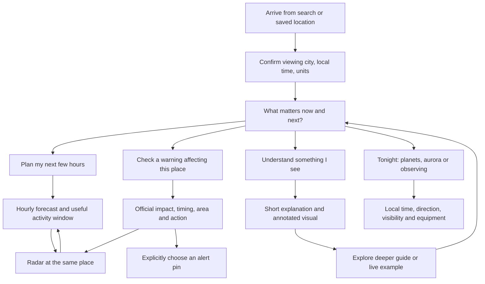

# 16-Bit Weather: user journey and data usefulness audit

**Reviewed:** September 25, 2026 · **Site:** https://www.16bitweather.co · **Audience:** everyday users first, with depth for enthusiasts.

## Assessment

The site has enough useful data to become an excellent weather product. The main constraint is that visitors have to interpret and reconcile too much of it themselves. Forecasts, warnings, radar, travel, and learning often feel like separate tools rather than steps in the same task.

The strongest foundation is the local forecast, its metric explanations, the warning-pin concept, and the breadth of the education library. The next investment should be **trustworthy values and connected journeys**, followed by visual learning and useful planning summaries. More feeds should come after these improvements.

This is an expert walkthrough and implementation review, not a user study. Statements about usefulness are product judgments to validate with real visitors. The defects below were reproduced in the browser, corroborated in source, or checked against the named primary reference.

## Coverage and limits

- Checked **371 distinct URLs**: all 302 sitemap URLs, 14 additional fixed application routes, and 55 discovered internal filter, pagination, tag, and RSS URLs. All returned HTTP 200; the page scan found no Next.js 404 marker. HTTP success did **not** mean that the page's data or interaction worked.
- Walked through the application's **47 page definitions**, using browser checks for the distinct screens and representative dynamic pages. Repeated templates were assessed through examples: New York and London forecasts, Cumulus and Cold Fronts guides, Ball Lightning, M31, a warning detail, and a current blog article. The URL inventory covers the remaining articles, cities, and catalog entries; their full prose was not individually fact-checked.
- Exercised searches, error recovery, daily expansion, all ten forecast metric explanations, share-copy dialogs, radar playback and presets, layers, warning filtering/detail navigation, flight and driving trip submissions, aviation route inputs, space-weather tabs, hemisphere switching, chart range selection, all Stargazer tabs, launch expansion, earthquake filtering/sorting, learning filters/cards, quiz wrong-answer/retry/completion/reset, blog filtering/pagination, news filtering/search/empty recovery, and account entry flows.
- Checked phone-sized layouts at **390 × 844** in Chrome after the in-app browser's viewport override failed to apply. Inspected forecast, navigation, radar/layers, travel, cloud atlas, warnings, Stargazer, and account screens. This is responsive browser testing, not physical iOS/Android device testing. A visible Apollo extension overlay was excluded from site findings.
- An existing signed-in browser session allowed read-only dashboard and profile inspection. Opened and cancelled Add Location and Edit Profile. Did not save preferences, change themes, delete/favorite locations, sign out, send emails, create accounts, upload observations, or grant notification/location permissions.
- Real alert delivery, OAuth completion, password reset delivery, subscription management with a valid private token, and every possible map feature/layer combination were not retested. No application code changed, so unit/build suites were not rerun.
- Live numbers changed during the walkthrough. Values below are examples observed during the audit, not a current forecast.

The complete automated URL inventory is in [the route checklist](./ux-audit-2026-09-25-routes.csv).

## The user paths the product should optimize

The viewing city and a saved **alert pin** should be visibly distinct. Browsing another city must never silently move a user's subscribed warning location.

| User question | Current path | Assessment | Better outcome |
|---|---|---|---|
| “What should I expect when I leave?” | Search → current conditions → hourly → daily detail | Useful raw data, weak synthesis; unit and placeholder defects undermine trust | A short local outlook: changing rain chances, temperature, gusts, and the best available outdoor window |
| “Is that storm coming toward me?” | Forecast preview → full radar → layers/playback → exit | Map and playback work; little interpretation; mobile controls compete with the map | Keep place and frame age visible, explain motion/history, and return to the same forecast |
| “Does this warning affect me?” | Global intensity badge or local card → warning desk → alert → radar | Local and national signals compete; detail-to-radar link lacks the selected polygon | Immediate local relevance, official action and expiry, then the same warning on a map |
| “Will my trip be affected?” | Travel → origin/destination → mode/day → score | Submission works, but duplicate controls and unsupported timing make results ambiguous | One trip state, dated forecast, named route segments, honest limits, and useful timing |
| “Can I see something in the sky tonight?” | Stargazer → conditions → targets/events | Rich enthusiast data; jargon, units and time zones impede casual use | “Visible from here, at this local time, in this direction, with this equipment” |
| “What cloud is that?” | Education → cloud atlas → details → guide | Text-rich but visually weak; cards aren't keyboard controls | A visual identification path with photos, distinguishing features, and a short explanation |
| “Keep my places and preferences” | Save → sign in → dashboard/profile | Core account screens exist and saved forecasts load | Clear save completion, consistent units across tools, and an explicit separation between saved cities and subscribed warning pins |

## Fix first: correctness and trust

### 1. International forecasts can display the wrong temperature unit

**Confirmed.** Searching `London` successfully loaded London, England. The hourly forecast showed values such as 64°F, while the daily cards showed **75°C / 57°C** for the same forecast. The daily component chooses its label from the country's code, independently of the actual unit of the supplied values.

**Change:** carry the selected unit with the weather data and use it consistently in current conditions, daily detail, hourly, dashboard, share cards, and Stargazer. Never infer the unit from the country after values have already been fetched or converted.

**Evidence:** `components/forecast.tsx:61`, `lib/weather/open-meteo-adapter.ts`, reproduced at `/weather/london`.

### 2. Daily forecast detail presents missing values as measurements

**Confirmed.** Expanding Saturday on the Pleasanton forecast displayed **Humidity 0%**. The adapter explicitly assigns daily humidity and cloud cover to zero, and assigns the current pressure to each future day.

**Change:** remove unavailable daily metrics or calculate clearly defined daily statistics from the hourly forecast. Show “Unavailable” when necessary. A missing value must not become a reassuring or alarming zero, and current pressure must not masquerade as future pressure.

**Evidence:** `lib/weather/open-meteo-adapter.ts:257`; daily detail in the browser.

### 3. Travel's “peak misery” is not calculated from the worst forecast hour

**Confirmed in browser and source.** A San Francisco → Los Angeles trip for **Tomorrow** returned a “Peak misery” window on **Sunday, September 27, 2–4 AM**, with a score of zero. `pickPeakWindow` adds an offset to the current clock; it does not find the worst hour in weather data. The waypoint service samples midday for future days.

**Change:** remove this claimed peak until it is computed from actual forecast timestamps and scores. Label the current product as a corridor weather overview. To offer a departure recommendation, add departure time, actual route segments, travel-time progression, and temporal scoring.

**Evidence:** `lib/services/trip-score-service.ts:130`, `lib/services/travel-corridor-service.ts:109`.

### 4. Expired information appears within active-alert experiences

**Confirmed presentation problem.** The warning desk contained rows explicitly labeled “EXPIRED” in its active experience. Space Weather showed **20 ACTIVE** while displaying a warning valid only until **12:00 UTC** at approximately **22:18 UTC**, and a watch for September 22–24 on September 25.

**Change:** define and enforce active/expired/cancelled/superseded states consistently. Separate recent messages from currently effective alerts. Count active events rather than every historical message where applicable. Keep the latest official instruction and source timestamps visible.

**Why it matters:** false urgency erodes attention to the next warning. “Updated just now” should not make an expired source message appear current.

### 5. Forecast and astronomy times do not consistently use the viewed location

**Confirmed.** With the browser in Pacific time, New York's hourly strip labeled the coming midnight **FRI**, although the forecast was rolling into Saturday. Stargazer's New York dark window was displayed as **5:19 PM–2:16 AM** without a time zone. Its separate hourly table labeled sunset-to-sunrise **“Dark window,”** while the hero and Moon Intel used astronomical darkness.

**Change:** format time and weekday together in the viewed location's time zone; include the zone where ambiguity matters. Distinguish sunset, astronomical dusk, astronomical dawn, and sunrise. Use the same definitions in every panel.

**Evidence:** `components/hourly-forecast.tsx:156`, `lib/stargazer/format.ts:11`, `components/stargazer/StargazerCommandCenter.tsx:43`, `components/stargazer/HourlyTimeline.tsx:147`.

### 6. Local relevance and coverage need to be explicit

**Confirmed.** “FOR YOUR AREA” included a New Caledonia earthquake while viewing California, New York, and London. A national **EXTREME 100** indicator appeared next to “No active alerts for this pin.” London's local panel used the same no-active-alerts wording even though the displayed warning categories come from the US NWS.

**Change:** make the primary status about the viewed location. Label national and global activity as such. Use “US warning coverage unavailable here” for unsupported locations, rather than a result that can be mistaken for local reassurance. Explain the three supported polygon-warning types beside the status.

Keep a deliberate distinction between “no matching warnings,” “data unavailable,” and “not covered.”

## Repair the paths that break or confuse

| Finding | Evidence | Recommended repair |
|---|---|---|
| The site's own **London, UK** example fails | Reproduced twice: example → Search → `/weather/london-uk` → Location not found. Searching `London` works. | Normalize country aliases and preserve resolved coordinates through routing; make all advertised examples pass. |
| The footer's **Hourly** link is a dead end | `/hourly` displays only “Location coordinates are required” and Back, despite a forecast already being available. | Pass viewing coordinates, or provide a location search and a useful recovery path. |
| Pressure displays two units | New York card visibly showed **29.81 in** with **hPa** directly below. | Store numeric pressure plus unit, then render one label. `components/weather-display.tsx:382` hard-codes hPa. |
| Tropical has two broken image feeds | Atlantic satellite GIF and Pacific SST GIF failed to load; direct requests returned **404** for both. | Replace obsolete sources, show visible failure/retry states, and surface the image's timestamp. The other two NHC outlook images loaded. |
| Manual aviation route entry fails for valid airports | KSFO → KDEN in “Search Turbulence Along Route” returned “Unable to resolve airport coordinates.” The separate SFO → DEN weather brief worked. | Unify airport resolution and explain ICAO vs IATA, preferably accepting either. |
| Aircraft data failure has weak recovery | Live map showed **DEGRADED · adsb.fi · 0 ac** throughout the visit. | Say whether traffic is unavailable or no aircraft are in view, show last successful update, and offer retry plus a weather-only view. Provider root cause was not established. |
| Travel exposes two independent mode/day controls | Top FLY and lower DRIVE could be selected simultaneously. A completed flight score remained above a national driving board. | Separate “My trip” and “National overview” with explicit headings, or unify the controls. |
| Corridor severity obscures a local hazard | “I-90 CLEAR — Dense fog,” “I-95 CLEAR — High winds,” and “5 flagged” appeared together. | Distinguish route-average conditions from the worst affected stretch; name the segment and time. Avoid “Clear” for a row's overall message when a significant local hazard is being highlighted. |
| Warning detail does not carry its map context | “Open radar for this polygon” links to plain `/radar`; official-source link goes to the weather.gov homepage. The standalone detail lacked the polygon map promised by the desk FAQ. | Open the selected warning geometry and bounding area; link to the actual official warning. Preserve filtering on return. |
| Severe alert cards do not offer direct detail navigation | Active warnings were presented as text cards; the available warning-desk link was separate. | Make each warning a meaningful link to its detail, retaining location and filter context. |
| Mobile radar prioritizes sharing over the place | At 390 px, the location became **“New …”** while four sharing controls remained visible. The lower dock obscured part of the legend and much of the map. | One Share action, a readable city label, a collapsible legend, and compact/collapsible playback controls. |
| Radar's latest label hides elapsed time | Historical frames show “Xm ago”; the latest state emphasizes “LATEST.” | Always show timestamp and age. “Latest available” does not imply a live or zero-delay observation. |

The two failing tropical URLs were `https://www.nhc.noaa.gov/satellite/satellite_atl_loop-vis.gif` and `https://www.nhc.noaa.gov/tafb/pac_sst.gif`.

## Learning should earn the user's trust and teach visually

### Correct the science before expanding the library

- The cloud atlas labels **13 entries as genera**, including Mammatus, Lenticular, and Asperitas. WMO defines **10 genera**; lenticularis is a species, while mamma and asperitas are supplementary features. [WMO genera](https://cloudatlas.wmo.int/en/clouds-genera.html), [lenticularis](https://cloudatlas.wmo.int/en/clouds-species-lenticularis.html), [mamma](https://cloudatlas.wmo.int/en/clouds-supplementary-features-mamma.html), [asperitas](https://cloudatlas.wmo.int/en/clouds-supplementary-features-asperitas.html).
- The solar-flare guide says C1 to X1 is a factor of **1,000**. It is **100**: C1 is 10⁻⁶ W/m² and X1 is 10⁻⁴ W/m². [NOAA flare classification](https://forecast.weather.gov/glossary.php?word=flare).
- The education hub promises radar **“reflectivity and velocity loops,”** but the radar reviewed exposes RainViewer precipitation composites, not a Doppler velocity product. Match the promise to the capability.
- Some rare-phenomenon cards present uncertain claims and precise rates as settled “scientific facts,” without citations. Ball Lightning included a 5% witness figure and the ability to pass through solid objects. These need a sourced editorial review, with observation, hypothesis, and uncertainty distinguished; this audit did not validate those claims.

### Make the reference tools usable for identification

The cloud atlas had no cloud photographs in its main content. Its first phone viewport was consumed by title, counts, and filters. The object catalog likewise offered a long list of 151 objects without search or equipment filters; the M31 guide was primarily prose and numerical facts.

Build toward these experiences:

1. **Cloud finder:** photo or faithful diagram → shape/height clues → likely family → “commonly confused with” comparison → what to watch next. A manual visual chooser can come before any image-recognition service.
2. **Storm cross-section:** an annotated cold/warm front showing lift, precipitation, wind shift, and the surface observer's experience. Let a user move through it step by step.
3. **Radar lesson:** explain an observed rain band using a labeled, dated example; include what radar cannot tell you. Link from the live legend to this explanation.
4. **Local metric lessons:** retain the helpful short popovers, but connect the explanation to the displayed value, units, source, and applicable period. Generic descriptions of station instruments should not imply that a modeled forecast value is a local station observation.
5. **Sky finder:** begin with naked eye/binoculars/telescope, then direction, local viewing time, apparent size, and a finder chart. Keep imaging specifications behind a deeper section.

The four-question altitude quiz worked, including incorrect-answer feedback, retries, completion, and reset. Its feedback after a wrong answer simply repeated the cloud description; an explanatory clue or diagram would make the mistake useful.

### Make the cards actual accessible controls

Cloud, weather-system, and phenomenon cards expand on mouse click but are plain `div` cards with no keyboard activation or button semantics. This was visible in the accessibility tree and confirmed in source. Use buttons/disclosures with focus states and `aria-expanded`, and preserve direct guide links. This is a specific accessibility finding, not a full WCAG certification.

**Evidence:** `app/cloud-types/page.tsx:252`, `app/weather-systems/page.tsx:155`, `app/fun-facts/page.tsx:83`, `components/ui/card.tsx`.

## Give astronomy a useful everyday entry point

Stargazer is currently optimized for someone already considering astrophotography. “Stay home and process data” assumes equipment and a workflow many visitors do not have. Scores such as **CLOUD 0 — Overcast** can also be read as zero cloud cover, while the actual coverage is 100%.

Lead with a plain answer: conditions for casual viewing, an appropriate time, direction, and realistic visibility. Keep scores explicitly labeled “condition score /100,” with the underlying metric alongside. Respect the site's selected units.

The space-weather dashboard also disagreed with itself: Kp 3 produced a 64°N viewline in one card and 58°N in another. Switching the map to Southern changed the latitude to 58°S while retaining “Southern Scandinavia, northern US border.” Use one shared viewline definition, appropriate hemisphere descriptions, and clear uncertainty. Do not turn an approximate latitude heuristic into a promise of visibility.

## Page-by-page usefulness and coverage

| Page or route family | What was inspected | Is the data useful for the intended audience? |
|---|---|---|
| `/` | Search, examples, invalid lookup, daily expansion, metric explanations, sharing, navigation | Yes: the best everyday entry point. Needs correct values, a short next-hours summary, and local relevance. |
| `/weather` | Climate directory and city navigation | Useful for travel/climate discovery. Add city search and a compact monthly comparison visual. Climate grouping should be secondary to finding a city. |
| `/weather/[city]` | New York, London, invalid city; forecast, climate detail, save/share, radar transition | Strong combination of live forecast and climate, but the international example/unit defects are blockers. All 48 sitemap city URLs received URL checks. |
| `/hourly` | Direct and footer destination | Currently fails without URL coordinates. Reconnect it to the viewing location. |
| `/radar` | Search, start/latest, pause, presets, speed controls observed, layer toggles, opacity, copied share state, mobile layers, return home | Highly useful. Same-tab city-to-radar retained New York correctly; direct new-tab radar asked for a location. Improve age, geography and mobile space. Not every frame/speed/feature combination was tested. |
| `/map` | Redirect to radar | Legacy entry resolves to the current radar experience. |
| `/radar-diagnostic` | Public diagnostic contents | Not a normal visitor destination. Instructions mix old WMS checks with the new RainViewer build; remove from user discovery or modernize as an internal diagnostic. |
| `/severe` | Categorical and tornado/hail/wind controls; Day 3 handling; active list | Useful for enthusiasts and next-day awareness. Day 3 correctly explains that only categorical outlook is available. Add local relevance and explain category/probability terminology. |
| `/warnings` | Pin, national/local lanes, California filtering, selected warning, detailed view, mobile hierarchy | Useful core concept. National intensity and a long elsewhere list dominate before the user's local result; expired-state handling and context links need repair. |
| `/warnings/[id]` | A Beach Hazards detail, official text and onward links | Official instructions are valuable. Lead with area/time/action, then technical codes. Provide the promised map and direct source. |
| `/alerts` | Pin and hazard controls; blank-email validation; guest flow copy | Strong low-friction concept; required-email validation worked. Explain acronyms such as PDS/IBW in plain language. Real subscriptions were not created. |
| `/alerts/manage`, `/alerts/verify` | Missing-token states and recovery links | Guarded routes behave as expected without a token. Distinguish an invalid link from service configuration failure in user-facing copy. Valid-token workflows were not exercised. |
| `/travel` | SFO→DEN flight, SF→LA drive for tomorrow; national board; desktop/mobile | Potentially very useful. Fix time derivation, duplicated controls, corridor labels and precision before marketing as departure planning. |
| `/aviation` | Degraded map state, manual flight brief, detail console, advisory section, manual ICAO turbulence route | Enthusiast depth is valuable. Casual travelers need understandable impact and source status. Two airport-entry systems give inconsistent results. Live aircraft selection was unavailable during the visit. |
| `/gfs-model/[region]/[run]` | `us/18z` | Displayed Model Unavailable and an official NOAA alternative. No successful model image/download verified. Better integrated under an advanced model section than news. |
| `/tropical` | All four image slots and NHC destinations | Two outlook images loaded, two feeds were 404s. Add storm identities, areas potentially affected, advisory age, and a basin-consistent overview. |
| `/winter` | Quiet/no-alert state and explanatory content | Clear empty state, but alerts alone do not answer snowfall timing/amount or commute impact. Additional winter forecasts would be a separate data feature. |
| `/earth-sciences` | Time/magnitude sort, M6+ filter, global map/list, source links | Strong provenance and useful links. Add distance/local felt-impact context; do not place a global event under “your area.” Clarify list limits and provisional event revisions. |
| `/space-weather` | All five tabs, solar image selection, hemisphere, chart range, alerts | Deep enthusiast tool; summaries, charts and messages need consistent timestamps, state and interpretation. Some icon-only controls lack useful names. |
| `/space-weather/{solar-flares,kp-index,solar-wind,aurora-forecast}` | All four guide pages and live summaries | Explanations connect data to meaning better than the dashboard. Bring that clarity into the dashboard; correct the flare-scale error and shared aurora logic. |
| `/stargazer` | Location lookup, four tabs, conditions, targets, events, launch expansion, mobile | Rich data. Fix time zones, labels and units; add an everyday viewing mode. |
| `/stargazer/objects` and `/stargazer/objects/[id]` | Full catalog structure and M31 guide | Valuable reference, difficult browsing. Add search, equipment/season/visibility filters and actual finding visuals. All 151 object-detail sitemap URLs received URL checks. |
| `/education` | Hub navigation, guide discovery, full quiz lifecycle | Good structure and cross-links. Start the visual lesson sooner and offer a return to the live context. |
| `/cloud-types` | Altitude/classification filters and expanded Mammatus; mobile layout | Good reference breadth, weak visual identification; taxonomy and keyboard access need repair. |
| `/weather-systems` | Frontal filter, expanded Cold Fronts, shareable guide transition | Useful depth; abstract numeric ranges and jargon precede intuition. Cross-sections would teach more effectively. |
| `/fun-facts` | Expanded Ball Lightning and guide links | Engaging exploration. Avoid presenting uncertain or loosely sourced facts with unwarranted precision. |
| `/education/glossary` | Metrics, value explanations, anchor navigation | Useful bridge from forecast to learning. Add search, concise initial definitions, and keep displayed metric semantics consistent with the actual feed. |
| `/education/cloud-types/[slug]`, `/education/weather-systems/[slug]`, `/education/phenomena/[slug]` | Cumulus, Cold Fronts and Ball Lightning | Cloud/front guides provide substantial prose and references; phenomenon guide has weaker sourcing. Add visuals, quick takeaways, and consistent reviewed/source metadata. All sitemap guide URLs received URL checks. |
| `/news` | Category filter, query, no-results state, recovery, story/source destinations inspected | Good source breadth and useful empty-state recovery. Raw bulletin text, duplicate event stories, encoded `&deg;`/`&#8217;` text and provisional magnitude differences need normalization/context. External articles were not individually opened or fact-checked. |
| `/blog` and `/blog/[slug]` | Category/pagination, current featured article, tags and return path | Useful editorial layer. Current featured title ends mid-sentence; generic agency labels are weaker than claim-level citations. All 48 article URLs received URL checks; this was not a fact-check of all articles. |
| `/about` | All three disclosure sections and module links | Personal purpose is appealing. Copy still claims games/tool-backed AI and an AI engine removed from the current product; theme counts also differ. Align it with what exists. |
| `/auth`, `/auth/login`, `/auth/signup` | Magic-link entry, password options, sign-up toggle, guest save prompt | Multiple entry methods are available. Use correct screen headings for sign-up and give a visible path back to the forecast. Actual authentication submissions were not made. |
| `/auth/reset-password`, `/auth/update-password`, `/auth/result` | Empty and invalid-link states; result redirect | Reset recovery exists. Direct `/auth/result` says “Authentication successful” even without a completed login; gate success copy on a verified session. |
| `/dashboard` | Guest view; existing signed-in saved forecasts, preferences, Add dialog | Saved forecasts and controls load. Avoid briefly presenting “No Saved Locations” while saved data loads. Make notification scope and unit behavior consistent throughout the site. No saved state was changed. |
| `/profile` | Guest redirect; existing profile view; Edit/Cancel | Clear separation from weather preferences. Programmatically associate the visible labels with fields; the controls had no associated labels in the DOM inspection. No profile values were changed. |

## Build next, using the data already available

| Improvement | User benefit | Data and constraints |
|---|---|---|
| Local “next few hours” summary | Quickly decide what to wear, carry, or plan around | Hourly temperature, rain probability, wind/gusts, UV and air quality; state the forecast interval and source |
| A single forecast/radar/learning journey | Explore a rain band and come back without re-entering a city | Carry viewing coordinates and return destination; keep alert subscriptions separate |
| Best available outdoor window | Compare nearby periods for a walk, commute or outing | Transparent preferences/thresholds over existing hourly data; avoid implying a guarantee |
| “Why this matters” on each metric | Learn without leaving the forecast | Existing glossary, connected to the actual value and time period; dew point is a useful next comfort metric |
| Visual cloud and storm lessons | Recognize something outside and understand the mechanism | Curated, licensed real examples plus diagrams; distinguish observed examples from illustrations |
| Beginner sky mode | Find something visible without knowing astronomy jargon | Existing celestial calculations + clouds/moon/darkness; add direction and equipment suitability |
| Visible data age and provenance | Know whether a result is fresh, modeled, measured, approximate or unavailable | Source timestamps and status carried through to every card, independent of the page refresh time |

Do not add a precise rain-arrival countdown using the current radar animation alone. RainViewer's public maps API supplies recent historical frames, and its public future nowcast product was discontinued. An arrival forecast would require a suitable provider or a separately validated, clearly labeled inference. [RainViewer maps API](https://www.rainviewer.com/api/weather-maps-api.html), [transition FAQ](https://www.rainviewer.com/api/transition-faq.html).

Ensemble spread/probabilities could later improve multi-day planning, but that would be a new integration, not a capability already verified in this site. [Open-Meteo ensemble API](https://open-meteo.com/en/docs/ensemble-api).

## Suggested delivery order

1. **Make the numbers honest:** temperature units, missing daily data, pressure labeling, local time/day labels, unsupported warning coverage, expired alerts, and the invented travel time window.
2. **Repair the journeys:** London example, Hourly entry, tropical images, aviation resolution, warning-to-radar/source links, and loading/failed-data states.
3. **Simplify the everyday experience:** local summary, one trip state, clear national/global labels, compact mobile radar, and consistent viewing-location context.
4. **Strengthen education:** correct taxonomy/science, keyboard-operable cards, photographs, cross-sections, and forecast-linked explanations.
5. **Add planning depth:** trustworthy outdoor windows, beginner astronomy, route/time-aware travel and, only where justified, new forecast/probability feeds.

For validation, ask a small group of everyday visitors to complete five tasks without coaching: pick an outdoor hour, identify whether a warning affects them, use radar and return, identify a cloud, and choose something to see tonight. Record completion, wrong conclusions, and confidence—not just clicks or time on site. Enthusiasts should then test the deeper controls separately.

## Closeout

Created this report and the URL checklist only. No application code, database records, subscriptions, profile values or saved account preferences were changed. Browser sizing was restored and the temporary mobile tabs were closed. Unit tests/build were not rerun because this was an audit. The report's unverified cases are explicitly listed above; fixes and deployment are separate work.
